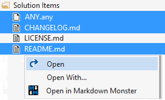
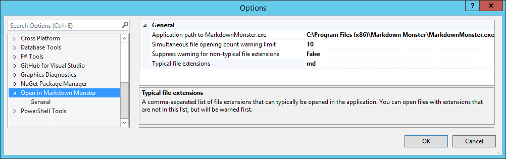

[AppVeyorProjectUrl]: https://ci.appveyor.com/project/GregTrevellick/openinpaintdotnet
[AppVeyorProjectBuildStatusBadgeSvg]: https://ci.appveyor.com/api/projects/status/33e93co68kooud5r?svg=true
[GitHubRepoURL]: https://github.com/GregTrevellick/OpenInPaintDotNet
[GitHubRepoIssuesURL]: https://github.com/GregTrevellick/OpenInPaintDotNet/issues
[GitHubRepoPullRequestsURL]: https://github.com/GregTrevellick/OpenInPaintDotNet/pulls
[ThirdPartyAppHomePage]: http://www.getpaint.net/
[ThirdPartyAppOfficialLogo]: http://www.getpaint.net/images/Logo4.png
[VersionNumberBadgeURL]: https://vsmarketplacebadge.apphb.com/version/GregTrevellick.OpenInAltovaXmlSpy.svg
[VSMarketplaceUrl]: https://marketplace.visualstudio.com/items?itemName=GregTrevellick.OpenInAltovaXmlSpy
[VSMarketplaceReviewsUrl]: https://marketplace.visualstudio.com/items?itemName=GregTrevellick.OpenInAltovaXmlSpy#review-details

# Open In $ThirdPartyAppName$

[![Build status][AppVeyorProjectBuildStatusBadgeSvg]][AppVeyorProjectUrl]
[][VersionNumberBadgeURL]

Download this extension from the [VS Marketplace][VSMarketplaceUrl].

---------------------------------------

<!--COPY START FOR VS GALLERY-->

A Visual Studio extension to open a file in [$ThirdPartyAppName$][ThirdPartyAppHomePage] directly from within Visual Studio.

[![][ThirdPartyAppOfficialLogo]][ThirdPartyAppHomePage]

If you like this *free* extension, please give it a [review][VSMarketplaceReviewsUrl].

See the [change log](CHANGELOG.md) for road map and release history. Bugs can be logged [here][GitHubRepoIssuesURL].

## Features

- Open multiple files simultaneously with $ThirdPartyAppName$ directly from within Solution Explorer.

- Warning if attemptimg to open a large quantity of files. The quantity is configurable, and if set very high effectively suppresses the warning altogether.

- Warning if attempting to open one or more file types whose extension is not typically associated with $ThirdPartyAppName$. The list of typical file extensions is configurable in Tools | Options, and the warning message can be suppressed.

## Options

<!--COPY END FOR VS GALLERY-->

## Contribute

Contributions to this project are welcome by raising an [Issue][GitHubRepoIssuesURL] or submitting a [Pull Request][GitHubRepoPullRequestsURL].

## License

[MIT](/LICENSE.txt)

## Legal

The [owner](https://github.com/GregTrevellick) of this [GitHub repository / software][GitHubRepoURL] is not affiliated, associated, authorized, endorsed by, employed by, sponsored by, or in any way officially connected with [$ThirdPartyAppName$][ThirdPartyAppHomePage] or any of its subsidiaries or its affiliates.

Nor has [this][GitHubRepoURL] software been authorised, approved, verified or in anyway assessed by [$ThirdPartyAppName$][ThirdPartyAppHomePage], or any of its subsidiaries or its affiliates, either as [raw source code][GitHubRepoURL] on [GitHub.com](https://github.com/) or as a [Visual Studio Extension][VSMarketplaceUrl] in the [Visual Studio Marketplace](https://marketplace.visualstudio.com/vs).

All Trademark, intellectual property rights, and other rights belonging to [$ThirdPartyAppName$][ThirdPartyAppHomePage] as described in [here][ThirdPartyAppHomePage] and [here][ThirdPartyAppHomePage] apply.

All $ThirdPartyAppName$ logos and $ThirdPartyAppName$ links belong to [$ThirdPartyAppName$][ThirdPartyAppHomePage] and their use here and any associated goodwill inures to [$ThirdPartyAppName$][ThirdPartyAppHomePage] as described [here][ThirdPartyAppHomePage].

In no event shall [$ThirdPartyAppName$][ThirdPartyAppHomePage] be liable for any claim, damages or other liability, whether in an action of contract, tort or otherwise, arising from, out of or in connection with the software or the use or dealings in the software.

## Credits

Adapted from code originally written by [Mads Kristensen](https://github.com/madskristensen) [here](https://github.com/madskristensen/OpenInSublimeText/ "Open in Sublime Text") and [here](https://github.com/madskristensen/OpenInVsCode "Open in Visual Studio Code").

Also adapted from code originally written by [Calvin Allen](https://github.com/CalvinAllen) [here](https://github.com/CalvinAllen/OpenInNotepadPlusPlus).

Additional thanks goes to [Build 2016 Conference](https://channel9.msdn.com/Events/Build/2016/B886) and [Visual Studio Toolbox](https://channel9.msdn.com/Shows/Visual-Studio-Toolbox/Extensions-by-Mads-Kristensen).

Thanks also to [$ThirdPartyAppName$][ThirdPartyAppHomePage] themselves.
